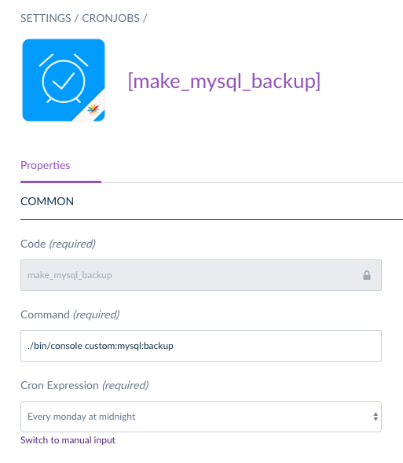

# Basecom CronUI Bundle


The basecom CronUI is an extension for [Akeneo](https://akeneo.com) community and 
enterprise edition. It adds a new user interface which can be used to create, manage 
and delete cronjobs. Also, it allows the developers to create cronjobs through code.

## Table of contents
1. [Installation](#installation)   
  1.1 [Requirements](#requirements)   
  1.2 [Install the bundle](#install-the-bundle)
2. [Usage](#usage)   
  2.1 [Define cronjobs in code](#define-cronjobs-in-code)   
    2.1.1 [Symfony Commands](#symfony-commands-commandcronjob)   
    2.1.2 [Akeneo Jobs](#akeneo-jobs-jobcronjob)   
  2.2 [Registering cronjobs](#registering-cronjobs)   
  2.3 [Define cronjobs in ui](#define-cronjobs-in-ui)
3. [Contributing](#contributing)
4. [Authors](#authors)
5. [License](#license)

## Installation

### Requirements

This bundle requires **[Akeneo 2.3 Community Edition](http://akeneo.com)** or higher. 
Also it requires **[PHP 7.1](http://php.net)** or higher.

### Install the bundle

1. Install this package via composer:
```bash
composer require basecom/akeneo-cron-ui
```

2. Follow the installation steps of the [Custom entity bundle](https://github.com/akeneo-labs/CustomEntityBundle) if not
already installed.

3. Add the bundle to the `AppKernel.php`:
```php
protected function registerProjectBundles()
{
    return [
        new \Basecom\Bundle\CronUiBundle\BasecomCronUiBundle(),
    ];
}
```

4. Run the doctrine schema update to create the new cronjobs table
```bash
php ./bin/console doctrine:schema:update --dump-sql --env=prod
php ./bin/console doctrine:schema:update --force --env=prod

```

5. Add the `cronjobs:run` command to the crontab:
```crontab
* * * * * cd /path-to-your-project && php ./bin/console cronjobs:run >> /dev/null 2>&1
```

6. Clear all caches and regenerate front-end assets:
```bash
php ./bin/console cache:clear --env=prod --no-warmup
php ./bin/console cache:warmup --env=prod
php ./bin/console pim:installer:assets --symlink --clean --env=prod
yarn run webpack
```

## Usage

There are two ways to create cronjobs. You can create them via the user interface, 
and you may define them in code. The benefit of creating them via code is that you can 
execute regular PHP code. The cronjobs defined in the user interface can perform any 
shell command, including but not limited to the [Symfony commands](https://symfony.com/doc/current/console.html).

### Define cronjobs in code

Every cronjob needs to implement the interface `Cronjob`. The interface consists of three methods: *getCronExpression*, *execute* and *getLabel*. The *getCronExpression* method can take any valid cron expression including *@daily*, *@monthly* and more. You can read more related to cron expressions [here](http://www.nncron.ru/help/EN/working/cron-format.htm). The *execute* method can run any php code. The *getLabel* method is only used for logging purposes and will never be shown inside the user interface.

A very basic cronjob, which curl's a specific url can be seen here:
```php
<?php

use Basecom\Bundle\CronUiBundle\CronAction\Cronjob;

class CurlCronjob implements Cronjob
{
    public function getCronExpression(): string
    {
        return '*/5 * * * *'; // Every five minutes
    }

    public function execute(): bool
    {
        $ch = curl_init('https://example.com');
        curl_setopt($ch,CURLOPT_RETURNTRANSFER,1);
        curl_setopt($ch,CURLOPT_TIMEOUT,10);
        $output = curl_exec($ch);
        $httpcode = curl_getinfo($ch, CURLINFO_HTTP_CODE);
        curl_close($ch);

        return $httpcode === 200; // Return true, if the status code is 200
    }

    public function getLabel(): string
    {
        return 'curl example.com';
    }
}
```

In addition to the interface there are multiple abstract classes which can be used for specific purposes (running a symfony command or akeneo job for example). If your own cronjob extends one of these classes there is no need to implement the interface manually since it is already implemented in the classes.

#### Symfony Commands (CommandCronjob)

This abstract class can be used to execute any symfony / akeneo command. Here is a basic example, which will run a "schema:update" every hour:

```php
<?php

use Basecom\Bundle\CronUiBundle\CronAction\CommandCronjob;

class SchemaUpdateCronjob extends CommandCronjob
{
    public function getCommand(): string
    {
        // This is the command which should be executed.
        // If you would run it manually: ./bin/console {command_name}
        return 'doctrine:schema:update';
    }

    public function getCommandParams(): array
    {
        // You don't need to override this method if you don't have specific parameters
        return [
            '--force',
            '--env' => 'prod'
        ];
    }

    public function getCronExpression(): string
    {
        // You can use simple aliases like '@hourly', '@daily' and so on..
        return '@hourly';
    }
}
```

#### Akeneo Jobs (JobCronjob)

The last abstract class allows the execution of import and export jobs for akeneo. It can take additional parameters (like the filePath) and run the job. All jobs are automatically put into the default akeneo queue. 

```php
<?php

use Basecom\Bundle\CronUiBundle\CronAction\JobCronjob;

class ExportProductsCronjob extends JobCronjob
{
    public function getJobName(): string
    {
        // This is the code / name of the akeneo job which should be executed.
        return 'csv_product_export';
    }

    public function getJobParams(): array
    {
        // This method must not be overriden if you don't need to override parameters.
        return [
            'filePath' => '/home/akeneo/my-daily-export/example.csv'
        ];
    }

    public function getCronExpression(): string
    {
        // The interface has some predefined constants for expression which are often used.
        return static::DAILY;
    }
}
```

### Registering cronjobs

To register your created cronjobs (regardless which interface and class you used) you just need to register the cronjob as a service and tag it with: `basecom.cronjob`. This is a example of the `ExportProductsCronjob` which is registered in `resources/config/cronjobs.yml`:

```yaml
parameters:
    basecom.cronjobs.export-products.class: 'Basecom\Bundle\SampleCronjobBundle\Cronjobs\ExportProductsCronjob'

services:
    basecom.cronjobs.export-products:
        class: '%basecom.cronjobs.export-products.class%'
        arguments:
        - '%kernel.root_dir%'
        tags:
        - { name: 'basecom.cronjob' }
```

The symfony and akeneo cronjobs require that you pass the kernel root dir as the first parameter. This is used to find the correct `./bin/console`file to execute the commands. Of course you can pass more arguments to your custom cronjobs. The symfony compiler will automatically find all registered cronjobs with the tag `basecom.cronjob`. 

### Define cronjobs in ui

It is also possible to register cronjobs through the UI of akeneo. This is useful if some cronjobs are different between stages of your application (e.g. staging, live, etc.). To register a new cronjob, navigate in the ui to `Settings` > `Cronjobs`.

To add a new cronjob, simply press the `Create` button and fill in a unique code and the command. **Every command is relative to the root directory of your installation**. So you may define commands like this: `./bin/console some:akeneo:command`. 


After the creation it will automatically open the edit page for this new cronjob. There you may define the cron expression. You can switch between the manual input and some predefined expressions. You can use any default [cron expressions](http://www.nncron.ru/help/EN/working/cron-format.htm).



## Contributing

If you need help or want to ask a question, [open an issue](https://github.com/basecom/akeneo-cronui/issues). If you found a bug or have a feature request please also  [open an issue](https://github.com/basecom/akeneo-cronui/issues). 

We welcome everyone to create Pull Requests and discuss new ideas. 

If you found a security-related issue, please send details via e-mail to [j.kniest@basecom.de](mailto:j.kniest@basecom.de)

## Authors


[basecom GmbH & Co. KG](https://basecom.de)

---

### Core Team

<table>
    <tr>
        <td>
            
        </td>
        <td>
        Jordan Kniest<br>
        <a href="mailto:j.kniest@basecom.de">Mail</a> &mdash; <a href="https://twitter.com/j_kniest">Twitter</a> &mdash; <a href="https://github.com/jkniest">Github</a>
    </td>
  </tr>
</table>

## License

Copyright basecom GmbH & Co. KG

Permission is hereby granted, free of charge, to any person obtaining a copy of this software and associated
documentation files (the "Software"), to deal in the Software without restriction, including without limitation the
rights to use, copy, modify, merge, publish, distribute, sublicense, and/or sell copies of the Software, and to permit
persons to whom the Software is furnished to do so, subject to the following conditions:

The above copyright notice and this permission notice shall be included in all copies or substantial portions of the
Software.

THE SOFTWARE IS PROVIDED "AS IS", WITHOUT WARRANTY OF ANY KIND, EXPRESS OR IMPLIED, INCLUDING BUT NOT LIMITED TO THE
WARRANTIES OF MERCHANTABILITY, FITNESS FOR A PARTICULAR PURPOSE AND NONINFRINGEMENT. IN NO EVENT SHALL THE AUTHORS OR
COPYRIGHT HOLDERS BE LIABLE FOR ANY CLAIM, DAMAGES OR OTHER LIABILITY, WHETHER IN AN ACTION OF CONTRACT, TORT OR
OTHERWISE, ARISING FROM, OUT OF OR IN CONNECTION WITH THE SOFTWARE OR THE USE OR OTHER DEALINGS IN THE SOFTWARE.